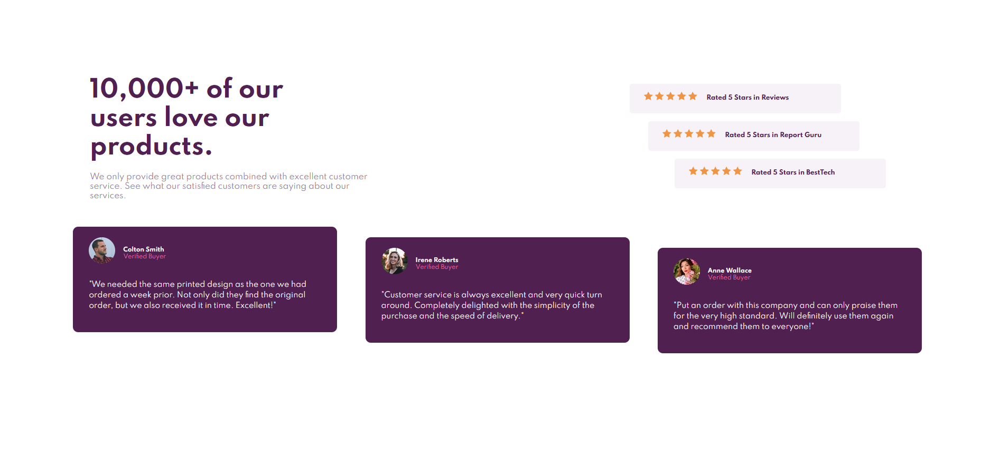
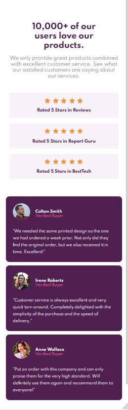

# Frontend Mentor - Social proof section solution

This is a solution to the [Social proof section challenge on Frontend Mentor](https://www.frontendmentor.io/challenges/social-proof-section-6e0qTv_bA). The purpose of this exercise is to practice semantic HTML and CSS in order to create a landing page.

## Table of contents

- [Overview](#overview)
  - [The challenge](#the-challenge)
  - [Screenshot](#screenshot)
  - [Links](#links)
- [My process](#my-process)
  - [Built with](#built-with)
  - [What I learned](#what-i-learned)
- [Author](#author)


## Overview

### The challenge

Users should be able to:

- View the optimal layout for the section depending on their device's screen size

### Screenshot


- Desktop design at 1440p.


- Mobile design at 375p.


### Links

- Github URL: [Github Solution](https://github.com/ibendiburg/6-social-proof-section-master)
- Live Site URL: [Live Demo](https://6-social-proof-section-master.vercel.app/)

## My process

### Built with

- Semantic HTML5 markup
- CSS custom properties
- Flexbox
- Mobile-first workflow


### What I learned

One of the things I got the change to do for the first time was to make the spacing between the star reviews form a stair case as well as the review cards must have different heights.

First in order to add different margin on the star reviews we added to the 2 on the bottom a class to differentiate them aside from the normal class they all share.
```html
 <div class="star-reviews div1">
 <div class="star-reviews div2">
 <div class="star-reviews div3">
```
finally on the css we just add some extra margin on the left in order to make the desired effect
```css
.div2{
  margin-left: 50px;
}
.div3{
  margin-left: 100px;
}
```
Now the approach for the review cards is similar in HTML where we add a second class to the element to be able to target the CSS more accurately.

And then as for the CSS we add position: relative and we move them a little bit down from their original position using top, as showed below: 
```css
.rev2{
    position: relative;
    top: 20px;
}
.rev3{
    position: relative;
    top: 40px;
}
```

## Author

- Frontend Mentor - [@ibendiburg](https://www.frontendmentor.io/profile/ibendiburg)

